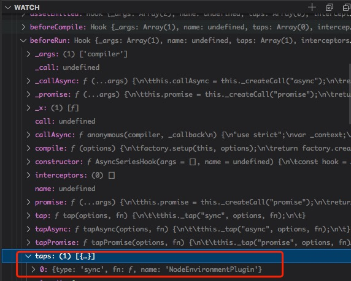
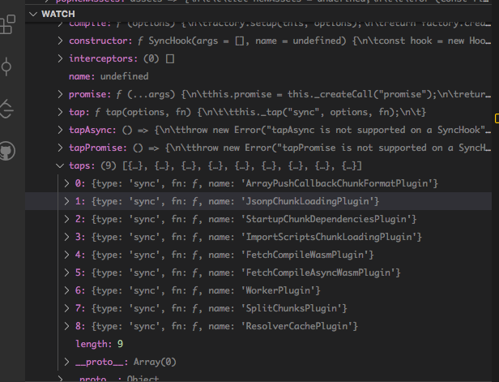
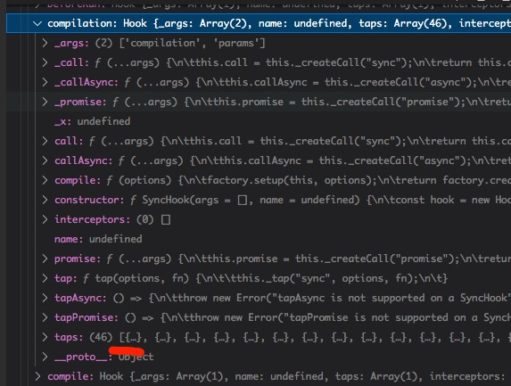
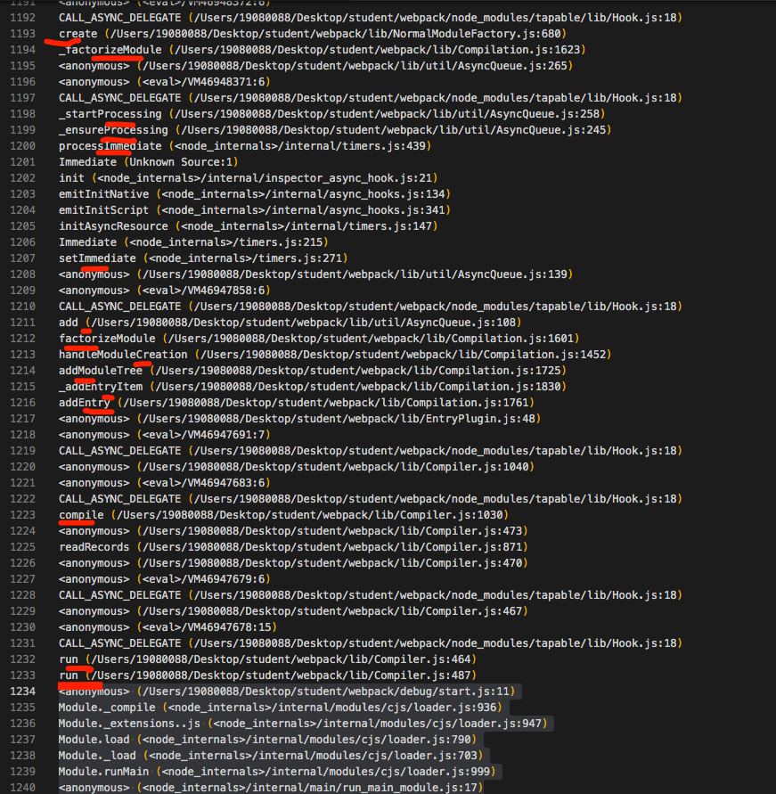
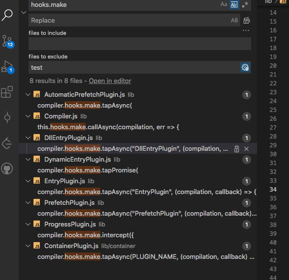

## webpack编译流程

> **webpack版本为 5.28.0**

说明一点看webpack的编译流程非常枯燥，即使看完理解之后也不见得能对本上有很多帮助。

- Entry: 指定`webpack`开始构建的入口模块，从该模块开始构建并计算出直接或间接依赖的模块或者库。
- Output：告诉`webpack`如何命名输出的文件以及输出的目录
- Module: 模块，在 `Webpack` 里一切皆模块，一个模块对应着一个文件。Webpack 会从配置的 `Entry` 开始递归找出所有依赖的模块。
- Chunk：`coding split`的产物，我们可以对一些代码打包成一个单独的chunk，比如某些公共模块，去重，更好的利用缓存。或者按需加载某些功能模块，优化加载时间。在`webpack3`及以前我们都利用`CommonsChunkPlugin`将一些公共代码分割成一个`chunk`，实现单独加载。在webpack4 中`CommonsChunkPlugin`被废弃，使用`SplitChunksPlugin`
- Loader：模块转换器，用于把模块原内容按照需求转换成新内容。
- Plugin：扩展插件，在 Webpack 构建流程中的特定时机会广播出对应的事件，插件可以监听这些事件的发生，在特定时机做对应的事情。

整体的编译流程大致如图所示，[简单的编译流程推荐文章](https://juejin.cn/post/6844903935828819981/)。


## webpack入口

首先明确一点本文章只关注webpack编译流程中主要流程，会按照上图所以的打包流程按照源码来记录。在保证记录主流程的基础上尽量说道各个主要的细节点。

`Webpack`可以将其理解是一种基于**事件流**的编程范例，一个插件合集。而将这些插件控制在**webapck事件流**上的运行的就是webpack自己写的基础类`Tapable`。`Webpack` 的事件流机制应用了**观察者模式**，和 `Node.js` 中的 `EventEmitter`非常相似。

webpack源码内部主要的概念：

- `compiler 对象`代表了完整的 `webpack 环境配置`。这个对象在启动 webpack 时被一次性建立，并配置好所有可操作的设置，包括 `options`，`loader` 和 `plugin`。当在 webpack 环境中应用一个插件时，插件将收到此 `compiler 对`象的引用。可以使用它来访问 webpack 的主环境。
- `compilation` 对象代表了一次资源版本构建。**当运行 webpack 开发环境中间件时，每当检测到一个文件变化，就会创建一个新的 compilation，从而生成一组新的编译资源**。一个 compilation 对象表现了当前的模块资源、编译生成资源、变化的文件、以及被跟踪依赖的状态信息。compilation 对象也提供了很多关键时机的回调，以供插件做自定义处理时选择使用
- `tapable`

webpack入口中主要做的事情详情如下：

| 事件名 | 解释 |
|:------:|:------------------------:|
| 初始化参数 | 从配置文件和 Shell 语句中读取与合并参数，得出最终的参数。 这个过程中还会执行配置文件中的插件实例化语句 new Plugin()。  |
| 实例化 Compiler | 用上一步得到的参数初始化 `Compiler` 实例，`Compiler` 负责文件监听和启动编译。`Compiler` 实例中包含了完整的 `Webpack` 配置，全局只有一个 `Compiler` 实例。  |
| 加载插件 | 依次调用插件的 `apply` 方法，让插件可以监听后续的所有事件节点。同时给插件传入 `compiler` 实例的引用，以方便插件通过 `compiler` 调用 `Webpack` 提供的 `API`。  |
| environment | 开始应用 `Node.js` 风格的文件系统到 `compiler` 对象，以方便后续的文件寻找和读取。 |
| entry-option | 读取配置的 `Entrys`，为每个 `Entry` 实例化一个对应的 `EntryPlugin`，为后面该 `Entry` 的递归解析工作做准备。 |
| after-plugins | 调用完所有内置的和配置的插件的 `apply` 方法。 |
| after-resolvers | 根据配置初始化完 `resolver`，`resolver` 负责在文件系统中寻找指定路径的文件。 |

**调试技巧**

在通过vscode或者浏览器进行调试时，一定要在watch里面添加三个函数`compiler`、`compilation`、`options`，不然你真的很难搞清楚它们是怎么变化的。并且这三个对象真的很复杂，有数不清的属性，回调函数等等。

开始调试的代码入口实在debug文件夹内部的代码`const webpack = require('../lib/index.js');const config = require('./webpack.config'); const compiler = webpack(config);`, 通过vscode的调试按钮来开始调试。

webpack源码代码的起点是在`../lib/index.js`文件中，导出的webpack的对象指向`get webpack() { return require("./webpack"); }`同层级文件夹下的`webpack.js`文件中。

> 在`lib/index.js`同时也到处了很多插件、方法。因为文件太多就不一一介绍，主要关注主流程。

看`lib/webpack.js`文件主要包含以下功能：

- 通过`getNormalizedWebpackOptions`合并webpack配置对象options(自定义配置、默认配置)，基础配置
- 实例化`comilper`对象
- 挂载`NodeEnvironmentPlugin`插件
- 挂载自定义插件
- 通过`applyWebpackOptionsDefaults`增加编译时需要的配置，如默认的`defaultRules`、`node`、`optimization`、`output`、`resolve`、`resolveLoader`对象。(有兴趣可以打断点进行查看)
- 调用环境钩子`compiler.hooks.environment.call(); compiler.hooks.afterEnvironment.call();`

通过`new WebpackOptionsApply().process(options, compiler);`往complier上面挂载各种默认插件、执行函数钩子。这个比较复杂下面展开讲。

根据上面列表的大致执行顺序结合代码分析。

```js
  // ./lib/webpack.js
  // callback传入为空
  const webpack = ((options, callback) => {
    const create = () => {
      // 校验传入的options类型是否符合webpack内部定义的webpackOptionsSchema范式
      validateSchema(webpackOptionsSchema, options);
      // ...省略代码
      // 判断传入的options是否为数组，创建多个compiler对象
      if (Array.isArray(options)) {
        /** @type {MultiCompiler} */
        // createMultiCompiler内部也是调用createCompiler方法
        compiler = createMultiCompiler(options, options);
        watch = options.some(options => options.watch);
        watchOptions = options.map(options => options.watchOptions || {});
      } else {
        /** @type {Compiler} */
        // 调用createCompiler并且传入options(webpack配置)
        compiler = createCompiler(options);
        watch = options.watch;
        watchOptions = options.watchOptions || {};
      }
    }
    // 返回创建的compiler、watch、watchOptions对象
    return { compiler, watch, watchOptions };
  })
```

真正创建compiler对象的是通过`createCompiler`函数，下面看一下`createCompiler`函数。

### createCompiler

代码如下：

```js
// ./lib/webpack.js
const createCompiler = rawOptions => {
  // 初始化基础配置，如output、devserver、plugin 给赋值一些默认的配置格式，防止后面使用时报错
  const options = getNormalizedWebpackOptions(rawOptions);
  // options上添加context
  applyWebpackOptionsBaseDefaults(options);
  // 实例化compiler，传入上面创建的options.context
  const compiler = new Compiler(options.context);
  // options赋值给compiler.options
  compiler.options = options;
  // 把NodeEnvironmentPlugin插件挂载到compiler实例上
  // NodeEnvironmentPlugin中主要把文件系统挂载到compiler对象上 如infrastructureLogger(log插件)、inputFileSystem(文件输入插件)、outputFileSystem(文件输出插件)、watchFileSystem(监听文件输入插件)
  // 绑定hooks.beforeRun.tap("NodeEnvironmentPlugin") 钩子执行inputFileSystem.purge();
  new NodeEnvironmentPlugin({
    infrastructureLogging: options.infrastructureLogging
  }).apply(compiler);
  // 判定options.plugins中是否有插件需要挂载到compiler上
  if (Array.isArray(options.plugins)) {
    for (const plugin of options.plugins) {
      // 如果存在plugin的类型为function，通过call调用
      if (typeof plugin === "function") {
        plugin.call(compiler, compiler);
      } else {
        // 如果plugin为object类型，或者class类型，就调用它内部的apply方法
        plugin.apply(compiler);
      }
    }
  }
  // 简单来说就是往options上添加各种默认的配置
  // 通过applyExperimentsDefaults往options上面添加experiments
  // 通过applyModuleDefaults往options上面添加module
  // 通过applyOutputDefaults往options上面添加output
  // 通过applyLoaderDefaults往options上面添加loader
  // 通过applyOptimizationDefaults往options上面添加optimization
  applyWebpackOptionsDefaults(options);
  // 调用触发compiler上的environment钩子，绑定environment钩子的回调函数执行
  compiler.hooks.environment.call();
  // 调用触发compiler上的afterEnvironment钩子，绑定afterEnvironment钩子的回调函数执行
  // compiler对象上添加watchFileSystem 插件  compiler.watchFileSystem = new IgnoringWatchFileSystem( compiler.watchFileSystem, this.paths );
  compiler.hooks.afterEnvironment.call();
  // 主要用于挂载默认插件和触发对应时期的钩子
  new WebpackOptionsApply().process(options, compiler);
  compiler.hooks.initialize.call();
  return compiler;
};
```

因为`createCompiler`中的内容有点多，所以分开描述比较好一点。`new WebpackOptionsApply().process(options, compiler);`其中的内容也比较多。

在`createCompiler`函数中首先通过`getNormalizedWebpackOptions`和`applyWebpackOptionsBaseDefaults`往`options`对象上添加默认属性、方法。通过`const compiler = new Compiler(options.context);`并且把`options`赋值给`compiler.options`；把`NodeEnvironmentPlugin`其中包含的**文件处理插件**挂载到`compiler`对象上。
自定义的插件是在`webpack.config.js`中配置的`plugins`数组。在`plugins`中可以是`函数`和`对象`，如果是**函数**通过`call`执行；如果是**对象**，并且对象上存在`apply`方法，调用对象上的`apply`函数挂载插件。
通过`applyWebpackOptionsDefaults(options);`再补全`options`上的默认配置。
执行`compiler.hooks`上的钩子，执行绑定钩子的函数。

**钩子调用顺序**

- compiler.hooks.environment.call() 同步钩子
- compiler.hooks.afterEnvironment.call() 同步钩子

### WebpackOptionsApply().process(options, compiler)

`new WebpackOptionsApply().process(options, compiler);`看着代码只有一点点，但是里面添加了很多默认的`plugins`进去，也触发了`compiler.hooks`对应的钩子。`WebpackOptionsApply`的声明在`./lib/WebpackOptionsApply.js`文件中。

> 如果在自定义的配置中增加了某些参数，也会在这里挂载相对应的插件。

`./lib/WebpackOptionsApply.js`中的有很多代码，这里只看主要的流程如下：

```js
  // ./lib/WebpackOptionsApply.js
  class WebpackOptionsApply extends OptionsApply {
    constructor() {
      super();
    }
    process(options, compiler) {
      // 很多判断，根据options上的配置，是否通过apply方法挂载插件；
      // 。。。。。。省略很多代码

      // 判断options.devtool是否为''或者false
      if (options.devtool) {
        // 因为devtool有很多中配置，保证在需要的插件内部能方位到complier对象；
        // 后面会再具体讲一下source-map插件的原理
        if (options.devtool.includes("source-map")) {
          const hidden = options.devtool.includes("hidden");
          const inline = options.devtool.includes("inline");
          const evalWrapped = options.devtool.includes("eval");
          const cheap = options.devtool.includes("cheap");
          const moduleMaps = options.devtool.includes("module");
          const noSources = options.devtool.includes("nosources");
          // 引入不同的插件
          const Plugin = evalWrapped
            ? require("./EvalSourceMapDevToolPlugin")
            : require("./SourceMapDevToolPlugin");
          // 保证在插件内部能方位到complier对象；绑定很多compiler.hooks钩子
          new Plugin({
            filename: inline ? null : options.output.sourceMapFilename,
            moduleFilenameTemplate: options.output.devtoolModuleFilenameTemplate,
            fallbackModuleFilenameTemplate:
              options.output.devtoolFallbackModuleFilenameTemplate,
            append: hidden ? false : undefined,
            module: moduleMaps ? true : cheap ? false : true,
            columns: cheap ? false : true,
            noSources: noSources,
            namespace: options.output.devtoolNamespace
          }).apply(compiler);
        } else if (options.devtool.includes("eval")) {
          const EvalDevToolModulePlugin = require("./EvalDevToolModulePlugin");
          new EvalDevToolModulePlugin({
            moduleFilenameTemplate: options.output.devtoolModuleFilenameTemplate,
            namespace: options.output.devtoolNamespace
          }).apply(compiler);
        }
      }
      // 。。。。。。省略很多代码

      // 通过apply方法挂载插件，并且绑定很多对应的钩子，js加载方式插件
      new JavascriptModulesPlugin().apply(compiler);
      
      // 。。。。。。省略很多代码
      
      // 通过apply方法挂载插件
      // 并且绑定compiler.hooks.entryOption钩子，回调函数中会根据options.entry的类型再分为两种加载入口插件 DynamicEntryPlugin插件；EntryPlugin插件
      new EntryOptionPlugin().apply(compiler);

      // 触发compiler.hooks.entryOption钩子执行对应的回调函数；
      // 如调试代码中设置的入口文件，就会再compiler对象上的compiler.hooks.compilation.taps 上添加了一个name 为EntryPlugin对象
      compiler.hooks.entryOption.call(options.context, options.entry);

      // 。。。。。。省略很多代码

      // 绑定compiler.hooks上面的钩子的回调函数；并且保证插件内部能访问到compiler对象或者compation对象

      // options.optimization 相关的插件

      // options.cache 相关的插件

      // AMDPlugin, CommonJsPlugin

      // 触发compiler.hooks.afterPlugins钩子函数，执行前面绑定的回调函数；
      // 该插件组合了 ContainerPlugin 和 ContainerReferencePlugin。重载（overrides）和可重载（overridables）被合并到指定共享模块的单个列表中。
      compiler.hooks.afterPlugins.call(compiler);

      // compiler.resolverFactory.hooks.resolveOptions 为HookMap
      
      // 触发compiler.hooks.afterResolvers，执行绑定的回调函数； 因为回调函数为空
      compiler.hooks.afterResolvers.call(compiler);
      
      // 返回options对象
      return options;
    }
  }
```

在`WebpackOptionsApply().process(options, compiler)` 主要是为了根据不同的自定义配置和默认配置给`compiler`对象上挂载不同的插件；并且为`compiler.hooks`上的钩子绑定很多回调函数。

`webpack`的插件的编写要提供一个`apply`方法，在初始化webpack插件时，会调用插件的`apply`方法，并且会传入`compiler`对象，方便在插件中做绑定`compiler.hooks`上的钩子函数和访问当前配置。

**钩子调用顺序**

- compiler.hooks.entryOption.call(options.context, options.entry) 同步钩子
- compiler.hooks.afterPlugins.call(compiler); 同步钩子
- compiler.hooks.initialize.call(); 同步钩子

### webpack 方法

在执行完成`createCompiler`方法后，返回`create`方法创建的`compiler`对象，代码如下：

```js
  // ./lib/webpack.js
  // callback传入为undefined
  const webpack = ((options, callback) => {
    // 上面详细看过的函数，这里不多做解释
    const create = () => { // ...省略代码 }
    if (callback) {
      // 省略代码。。。
    } else {
      // 通过create()方法会返回 三个对象compiler、watch、watchOptions对象
      // compiler中间储存了当前编译的的配置
      // watch、watchOptions都为undefined
      const { compiler, watch } = create();
      if (watch) {
        util.deprecate(
          () => {},
          "A 'callback' argument need to be provided to the 'webpack(options, callback)' function when the 'watch' option is set. There is no way to handle the 'watch' option without a callback.",
          "DEP_WEBPACK_WATCH_WITHOUT_CALLBACK"
        )();
      }
      // 返回当前编译环境的compiler对象
      return compiler;
    }
  })
```

在执行完成`const compiler = webpack(config);`会返回当前编译环境的`compiler`对象，在这一步的时候当前编译环境中的`options`都配置完成。下一步执行调试代码中的`compiler.run(() => {})`。

## compiler.run

下面开始进入编译流程，执行`debug/start.js`中的流程`compiler.run`，代码如下：

```js
// debug/start.js
// 进入compiler.run流程，并且传入回调函数，收集编译信息和报错信息
compiler.run((err, stats)=>{
  if(err){
      console.error(err)
  }else{
      console.log(stats)
  }
})
```

首先要了解`compiler`类的实现才能知道后续流程执行的过程。代码如下：

**./lib/compiler**

```js
// ./lib/compiler
const Cache = require("./Cache"); // ./lib/Cache
const {
  SyncHook,
  SyncBailHook,
  AsyncParallelHook,
  AsyncSeriesHook
} = require("tapable"); // 引入tapbale库
// ./lib/compiler
class Compuler {
  constructor(context) {
    // 主要打变量赋值
    this.hooks = Object.freeze({
      // 定义各种的hooks
      /** @type {AsyncSeriesHook<[Compiler]>} */
      beforeRun: new AsyncSeriesHook(["compiler"]),
      /** @type {AsyncSeriesHook<[Compiler]>} */
      run: new AsyncSeriesHook(["compiler"])
    })
    // 赋值其它变量
    /** @type {boolean} */
    this.idle = false;
    // 实例化一个Cache类
    this.cache = new Cache();
    // 省略代码....
  }
  // 获取cache
  getCache(name) {}

  run (callback) {
    // 判断代码是否正在执行
    if (this.running) {
      return callback(new ConcurrentCompilationError());
    }
    // 执行完成的回调 暂时先不看 后面会看到
    const finalCallback = (err, stats) => {
      // 省略代码....
    };
    const startTime = Date.now();
    this.running = true;
    // 下面this.compile中传入的回调函数 后面会具体说
    const onCompiled = (err, compilation) => {
      // 省略代码....
    }
    // 后面真正要执行的代码
    const run = () => {
      // 触发beforeRun钩子，执行绑定的回调
      this.hooks.beforeRun.callAsync(this, err => {
        // 如果报错直接退出当前编译，并且返回报错信息
        if (err) return finalCallback(err);
        // 在执行完成异步钩子beforeRun；后再执行run一步钩子
        this.hooks.run.callAsync(this, err => {
          if (err) return finalCallback(err);
          // 执行readRecords方法
          this.readRecords(err => {
            if (err) return finalCallback(err);
            // 执行this.compile方法并且传入当前onCompiled作为回调函数
            this.compile(onCompiled);
          });
        });
      });
    };
    // this.idle 默认为false
    if (this.idle) {
      // 这里的代码暂时不做解释
      this.cache.endIdle(err => {
        if (err) return finalCallback(err);
        this.idle = false;
        run();
      });
    } else {
      // 执行啥名定义的run()方法
      run();
    }

  }
  // 后面定义的方法暂时不在此一一列出等用到了会标注清楚
  // ...省略代码
}
```

在`compiler`类中通过`tapable`库定义了很多`hooks`，webpack的**生命周期或执行流程**就是通过`hooks`串联起来的。`compiler.run()`方法内部又定义了三个函数`finalCallback`、`onCompiled`、`内部run(为了区别compiler.run)`。
在下面会直接调用`内部run`方法，会执行`this.hooks.beforeRun.callAsync`代码，触发`this.hooks.beforeRun`异步钩子绑定的回调函数。那里绑定了`this.hooks.beforeRun`钩子呢？

这里通过`watch`compiler对象内部的`hooks.beforeRun.taps`中储存了回调函数数组。如下图所示：


`hooks.beforeRun`只绑定了一个回调函数，在`NodeEnvironmentPlugin(文件地址 ./lib/node/NodeEnvironmentPlugin.js)`插件中绑定的回调函数，回调函数会做一个文件系统的**清除缓存**操作，代码如下：

```js
  // 回调函数传入compiler对象作为参数
  compiler.hooks.beforeRun.tap("NodeEnvironmentPlugin", compiler => {
    // 判断当前inputFileSystem 和 当前类中的inputFileSystem相同
    if (compiler.inputFileSystem === inputFileSystem) {
      // 执行inputFileSystem中的清除操作
      inputFileSystem.purge();
    }
  });
```

> 有两种方式可以查看`this.hooks.beforeRun`其中绑定那些回调函数，一种全局搜索`hooks.beforeRun`,另一种还是通过`vscode`调试代码时添加`watch`观测`compiler`对象。

在触发完成`hooks.beforeRun`钩子后，接着触发`hooks.run`钩子，`hooks.run`没有绑定任何回调函数。`hooks.run`表示编译开始。

第一次编译直接可以忽略`this.readRecords`方法，直接看`this.compile(onCompiled);`，`this.compile`是一个比较复杂的过程，再进行拆分。

**钩子调用顺序**

- compiler.hooks.beforeRun.callAsync(compiler.hooks.run()) 异步钩子
- compiler.hooks.run.callAsync(this.complie(onCompiled)) 异步钩子

## compiler.compile(this.compile)

首先看一下`this.compile(compiler中定义)`方法的定义和传入的回调函数`onCompiled(compiler.run中定义的)`的定义，代码如下：

```js
  // ./lib/compiler.js

  class Compiler {
    // 省略代码...
    constuctor () {}
    // 省略代码...

    // 定义NormalModuleFactory工厂函数
    createNormalModuleFactory() {
      const normalModuleFactory = new NormalModuleFactory({
        context: this.options.context,
        fs: this.inputFileSystem,
        resolverFactory: this.resolverFactory,
        options: this.options.module,
        associatedObjectForCache: this.root,
        layers: this.options.experiments.layers
      });
      // 触发normalModuleFactory钩子函数并且传入工厂函数
      this.hooks.normalModuleFactory.call(normalModuleFactory);
      // 返回工程函数
      return normalModuleFactory;
    }
    // 定义ContextModuleFactory工厂函数
    createContextModuleFactory() {
      const contextModuleFactory = new ContextModuleFactory(this.resolverFactory);
      // 触发contextModuleFactory钩子函数并且传入工厂函数
      this.hooks.contextModuleFactory.call(contextModuleFactory);
      // 返回工程函数
      return contextModuleFactory;
    }

    // 创建Compliation所要用到的参数
    newCompilationParams() {
      const params = {
        // 触发对应的钩子并且返回工厂函数实例
        normalModuleFactory: this.createNormalModuleFactory(),
        contextModuleFactory: this.createContextModuleFactory()
      };
      return params;
    }

    // 通过new Compilation(compiler)实例化Compilation并且返回
    createCompilation() {
      return new Compilation(this);
    }

    // 创建compilation实例
    newCompilation(params) {
      // 创建Compilation函数
      const compilation = this.createCompilation();
      compilation.name = this.name;
      compilation.records = this.records;
      //  触发thisCompilation钩子，传入 compilation实例 和 { NormalModuleFactory, ContextModuleFactory}
      this.hooks.thisCompilation.call(compilation, params);
      //  触发thisCompilation钩子 传入 compilation实例 和 { NormalModuleFactory, ContextModuleFactory}
      this.hooks.compilation.call(compilation, params);
      // 返回compilation实例
      return compilation;
    }


    // 创建compile方法并且传入callback; 在compiler.run()中通过this.compile(onCompiled)调用
    compile (callback) {
      // 通过newCompilationParams()获取两个工厂函数
      // createNormalModuleFactory 用于创建NormalModuleFactory
      // createContextModuleFactory 用于创建ContextModuleFactory
      const params = this.newCompilationParams();
      // 触发beforeCompile钩子；并且传入当前传入compilation的参数
      this.hooks.beforeCompile.callAsync(params, err => {
        // 触发beforeCompile钩子；并且传入当前传入compilation的参数
        this.hooks.compile.call(params);
        // 获取compiation实例
        const compilation = this.newCompilation(params);
        // 触发make钩子执行绑定的回调函数，传入compilation实例 回调函数
        this.hooks.make.callAsync(compilation, err => {
          // 触发finishMake函数钩子执行绑定的回调函，传入compilation实例 回调函数
          this.hooks.finishMake.callAsync(compilation, err => {
            process.nextTick(() => {
              // 执行 compilation 实例上的finish方法
              compilation.finish(err => {
                 // 执行 compilation 实例上的seal方法
                compilation.seal(err => {
                  // 触发afterCompile函数钩子执行绑定的回调函，传入compilation实例 回调函数
                  this.hooks.afterCompile.callAsync(compilation, err => {
                    // 执行传入的onCompiled回调函数，并且传入compilation实例，返回执行结果
                    return callback(null, compilation);
                  });
                });
              });
            });
          });
        });
      });
    }
  }
```

这一步骤里面的代码太多了，很多代码后面又会触发其他的钩子，尽可能细的去看它们背后执行了什么。`compile`方法中就是真正的开始编译流程，下面就开始看一下`webpack`是怎么实现的。下面代码都是从上面代码分解出来了，一步一步来了解是怎么实现的。

```js

   compile (callback) {
    // 通过newCompilationParams()获取两个工厂函数
    // createNormalModuleFactory 用于创建NormalModuleFactory
    // createContextModuleFactory 用于创建ContextModuleFactory
     const params = this.newCompilationParams();
     
   }
```

在`compile`方法中首先会实例化两个有关于`Module`的两个工厂函数，这个两个工厂还是也是非常重要的是后续用来解析`module`的`normalModule`和`contextModule`。如果对这个感兴趣的话可以去看[NormalModuleFactory过程](./NormalModuleFactory.md)。

以`NormalModuleFactory`工厂函数为例，它主要实现的功能是：

- 通过`loader`的`resolver`来解析`loader`路径
- 使用`Factory`创建 `NormalModule`实例
- 使用`loaderResolver`解析`loader`模块路径
- 根据`rule.modules`创建`RulesSet`规则集
- 使用 `loader-runner` 运行 `loaders`
- 通过 `Parser` 解析 (内部是 `acron`)
- `ParserPlugins` 添加依赖

在`compiler.compile`方法中首先初始化了两个工厂函数`(normalModuleFactory、contextModuleFactory)`，并且把两个工厂函数实例储存到`params`变量中。`this.hooks.beforeCompile`触发编译前`beforeCompile`钩子，钩子函数上没有绑定任何函数；`this.hooks.compile`编译即将启动钩子，也没有绑定任何回调函数；
通过`this.newCompilation`初始化一个`Compilation`实例，接下来触发`thisCompilation.call`钩子，这个钩子上面绑定了`9个`回调函数，如下图所示：



执行`compilation.call`同步钩子，当前钩子上绑定了`46个`回调函数，如下图所示：



> `compilation实例` 对象代表了一次资源版本构建。当运行 webpack 开发环境中间件时，每当检测到一个文件变化，就会创建一个新的 `compilation`，从而生成一组新的编译资源。一个 `compilation 对象`表现了当前的模块资源、编译生成资源、变化的文件、以及被跟踪依赖的状态信息。

**compilation**中主要功能：

<!-- TODO: 总结compliation -->

在返回`compilation`实例对象后，执行`compiler.hooks.make.callAsync`钩子开始真正的编译过程，`compilation.addEntry`从入口文件开始编译。

因为`make`是一个入口文件内容也比较多，再把这个过程看做一个独立的模块。

**钩子调用顺序**

- compiler.hooks.beforeCompile.callAsync(params: {normalModuleFactory, contextModuleFactory }) 异步钩子
- compiler.hooks.normalModuleFactory.call(normalModuleFactory)/compiler.hooks.contextModuleFactory.call(contextModuleFactory) 同步钩子
- compiler.hooks.compile.call(params: {normalModuleFactory, contextModuleFactory }) 同步钩子
- compiler.hooks.thisCompilation.call(compilation // 实例, params: {normalModuleFactory, contextModuleFactory }) 同步钩子
- compiler.hooks.compilation.call(compilation // 实例, params: {normalModuleFactory, contextModuleFactory }) 同步钩子
- compiler.hooks.make.callAsync(compilation // 实例, callback) 异步钩子

### compiler.hooks.make.callAsync(compilation)

> addEntry 中无论是那个版本的webpack 都是回调地狱，并且很多钩子在nextTick中执行，很难找，希望在norModuleFactory中能梳理清楚，数不清楚的回调函数。再加上异步和tapable，导致调用栈都不能很好的梳理清楚。

大致执行流程是`compilation.addEntry => compilation._addEntryItem => compilation.addModuleTree => compilation.handleModuleCreation => compilation.factorizeModule => compilation._factorizeModule => NormalModuleFactory.create => compilation.addModule => compilation._addModule => compilation.buildModule => compilation._buildModule => normalModule.build => normalModule.doBuild => runLoaders(normalModule中的执行) => this.parser.parse(normalModule中的执行)`

vscode调试调用栈部分如下图所示：



执行`compiler.hooks.make.callAsync(compilation)`触发`make钩子`，有很多个插件绑定了`compiler.hooks.make`钩子，绑定钩子的插件如下图所示：



这里只关注了`entryPulgin`内部绑定的回调函数，在回调函数中执行`compilation.addEntry(context, dep, options, err=> {})`；

```js
  // ./lib/compilation.js
  class Compilation {
    addEntry(context, entry, optionsOrName, callback) {
      // 执行添加入口文件
      this._addEntryItem(context, entry, "dependencies", options, callback);
    }
    _addEntryItem(context, entry, target, options, callback) {
      // 入口数据添加进entries中
      this.entries.set(name, entryData);
      // 触发addEntry钩子
      this.hooks.addEntry.call(entry, options);
      // addModuleTree添加module树
      this.addModuleTree({})
    }
    addModuleTree({ context, dependency, contextInfo }, callback) {
      this.handleModuleCreation({ factory: moduleFactory, dependencies: [dependency], originModule: null, contextInfo, context }, callback)
    }
    _factorizeModule({ currentProfile, factory, dependencies, originModule, contextInfo, context }, callback) {
      // 执行NormalModuleFactory实例上的create方法
      factory.create()
    }
    factorizeModule(options, callback) {
      this.factorizeQueue.add(options, callback);
    }
    addModule(module, callback) {
      this.addModuleQueue.add(module, callback);
    }
    _addModule(module, callback) {
      // 添加创建到的module到modules
      this._modules.set(identifier, module);
      this.modules.add(module);
    }

    handleModuleCreation({factory, dependencies, originModule, contextInfo, context, recursive = true }, callback) {
      // 执行this.factorizeModule函数
      this.factorizeModule({ currentProfile, factory, dependencies, originModule, contextInfo, context }, (err, newModule) => {
        // 在执行this.factorizeModule之后会执行this._factorizeModule => 再调用factory.create()
        // 在执行完成module的解析后才会执行this.addModule
        this.addModule(newModule, (err, module) => {
          // 先执行this._addModule
          // 再执行buildModule 对新创建的module进行AST转化和loader解析
          this.buildModule(module, err => {
            // 执行this._buildModule 收集buildModules
            // 对buildModule.module上的依赖递归收集依赖
            this.processModuleDependencies(module, err => {
              if (err) {
                return callback(err);
              }
              callback(null, module);
            });
          })
        })
      })
    })
  }
```

在`compilation.addEntry`会直接调用`compilation._addEntryItem`内部执行操作如下：

- 执行`this.entries.set(name, entryData);`添加入口文件配置
- 执行`compilation.hooks.addEntry.call(entry, options);`执行addEntry钩子，绑定钩子的插件有`ProgressPlugin`、`RuntimeChunkPlugin`，执行对应的回调函数
- 调用`compilation.addModuleTree(context, dependency: entry, contextInfo: undefined)`

在 `compilation.addModuleTree`中执行大致如下：

- `const moduleFactory = this.dependencyFactories.get(Dep);` 获取工厂函数；
- 调用`compilation.handleModuleCreation(factory: moduleFactory // 工厂函数, dependencies: [dependency])`

`compilation.handleModuleCreation`方法执行如下操作：

- 调用`compilation.factorizeModule(factory// 工厂函数, dependencies // 依赖项, (err, newModule) => { this.addModule; })`方法
- 回调函数中有调用了`compilation.addModule`方法；`compilation.addModule`的回调函数中又调用了`compilation.buildModule`方法

`compilation.factorizeModule`方法执行如下操作：

`this.factorizeQueue.add(options, callback);`，调用一开始初始化`compilation`时，初始化的`this.factorizeQueue = new AsyncQueue({ name: "factorize", parent: this.addModuleQueue, processor: this._factorizeModule.bind(this) });`

- `compilation.factorizeQueue.add()`主要的操作是`setImmediate(root._ensureProcessing);` 在下一个进程中添加一个`AsyncQueue._ensureProcessing`方法。

在下一个nextTick中，执行链大致如下`AsyncQueue._ensureProcessing => AsyncQueue._startProcessing => compilation._factorizeModule`。

下面看`compilation._factorizeModule`方法过程大致如下：

- `factory.create`会调用在`compiler`中创建`normalModuleFactory`或者`contextModuleFactory`，会调用`NormalModuleFactory.create`方法。

`NormalModuleFactory.create`方法执行过程大致如下：

- 创建`resolveData`对象用于储存一些信息
- 触发`NormalModuleFactory.hooks.beforeResolve.callAsync(resolveData, callback)`钩子，没有绑定任何回调函数，直接执行传入的`callback`函数。
- 触发`NormalModuleFactory.hooks.factorize.callAsync(resolveData, callback)`，在实例化`NormalModuleFactoryPlugin`时，已经绑定过`NormalModuleFactory.hooks.factorize.tapAsync({ name: "NormalModuleFactory", stage: 100 }, callback)`; `callback`回调函数中直接执行了`NormalModuleFactory.hooks.resolve.callAsync(resolveData, callback)`
- 触发`NormalModuleFactory.hooks.resolve.callAsync(resolveData, callback)`钩子函数执行`loaderResolver`解析`loader`绝对路径；`normalResolver`解析`文件`和`module` 的绝对路径;
- 执行`NormalModuleFactory.resolverFactory.get` 这里不展开看了，如果感兴趣可以去看[NormalModuleFactory过程](./NormalModuleFactory.md)。
- 执行`NormalModuleFactory.ruleSet.exec`使用RuleSet对象来匹配模块所需的`loader`。
- 执行`NormalModuleFactory.hooks.resolve.tapAsync`回调函数中会在`data.createData`添加`parser: this.getParser(type, settings.parser); generator: this.getGenerator(type, settings.generator)` 用于后面转换`AST`树和生成代码
- 执行`NormalModuleFactory.hooks.afterResolve`钩子
- 执行`NormalModuleFactory.hooks.createModule`和`NormalModuleFactory.hooks.module`钩子

执行`compilation.addModule => compilation._addModule`添加module模块，执行大致如下：

- 执行`compilation._modules.set(identifier, module);` 和 `compilation.modules.add(module);`添加模块

执行`compilation.buildModule => compilation._buildModule`开始编译模块，`_buildModule`中会执行如下操作：

- 执行`module.needBuild(NormalModule.needBuild)`会执行到`NormalModule`中的`needBuild`方法；在回调函数中执行`module.build(NormalModule.build)`
- 触发`compilation.hooks.buildModule.call(module)`钩子，在`SourceMapDevToolModuleOptionsPlugin`插件中执行`buildModule`回调函数。[sourceMap 相关](./sourceMap.md)有兴趣了解`sourceMap`的可以看一下。
- 执行`compilation.builtModules.add(module)`

在`NormalModule.js`文件下执行`module.build(NormalModule.build)`，大致执行过程如下：

- 执行`NormalModule.doBuild`函数，创建`loaderContext`和`_source`对象；
- 创建并触发`NormalModule.hooks.beforeLoaders.call`钩子
- 通过`runLoaders`运行相关的loader
- 执行`this.parser.parse`源码进行`AST`的转换

执行完成`module.build(NormalModule.build)`接着会执行到`compilation.processModuleDependencies(module, callback)`，对`module`递归进行依赖收集，执行过程如下：

- 执行`compilation.processModuleDependencies(module, callback)`并且传入`buildModule`生成的`module`实例；
- 执行`compilation._processModuleDependencies(module, callback)`，通过`processDependenciesBlock`进行递归收集依赖；
- 循环执行`compilation.handleModuleCreation`再进行模块转换、依赖收集

在对所有`module`处理完成之后执行`compiler.compiler`中的`hooks.finishMake`钩子，代码如下:

```js
  // ./lib/compiler.js
  class Compiler {
    compile (callback) {
      // 执行make钩子 递归处理module
      this.hooks.make.callAsync(compilation, err => {
        // 执行finishMake钩子
        this.hooks.finishMake.callAsync(compilation, err => {
          process.nextTick(() => {
            // 执行compilation的finsh方法 对modules上的错误或者警告处理
            // finsh中会执行compilation.hooks.finishModules钩子
            compilation.finish(err => {
              // 执行seal 对module代码进行封装输出
              compilation.seal(err => {
                // 触发compiler.hooks.afterCompile钩子
                this.hooks.afterCompile.callAsync(compilation, err => {
                  // 执行传入的callback方法
                  return callback(null, compilation);
                })
              })
            })
          })
        })
      })
    }
  }
```

在`make`钩子函数完成之后，会执行当前`compilation`上的`finsh`方法，对生成的`modules`时产生的错误或者警告进行处理；触发`compilation.hooks.finshModules`钩子。
下面进入另一个重要的过程**封装**、**输出**阶段，在这个阶段就是对上一个阶段处理完成的`modules`进行封装输出；这个阶段的入口是`compilation.seal`，会生成`chunk`和`assets`等信息，根据不同的`template`生成要输出的代码。

**钩子调用顺序**

- compiler.hooks.make.callAsync(compilation // 实例, callback) 异步钩子
- compiler.hooks.finishMake.callAsync(compilation // 实例, callback)  异步钩子
- compiler.hooks.afterCompile.callAsync(compilation // 实例, callback)  异步钩子

## compilation.seal(callback)

`compilation.seal`是封装、输出流程的入口，看一下webpack中是如何对上一步`compilation.modules`生成`chunkGroup`和文件。

几个概念比较重要如下：

- `module`: 就是不同的资源文件，包含了你的代码中提供的例如：`js/css/图片` 等文件，在编译环节，`webpack`会根据不同 `module` 之间的依赖关系去组合生成 `chunk`.
- `moduleGraph`: 用于存储各个`module`之间的关系，对于后面生成`chunkGraph`也要用到。
- `entryPoint/chunkGroup`: 由一个或者多个`chunk`组成，在生成`chunkGraph`时候要用到。
- `chunkGraph`: 用于储存`module`、`chunk`、`chunkGroup` 三者之间的关系
- `chunk`: 由一个或者多个`module`组成，它是 webpack 编译打包后输出的最终文件；

```js
  // lib/compilation.js
  class Compilation {
    seal (callback) {
      // 实例ChunkGraph类
      const chunkGraph = new ChunkGraph(this.moduleGraph);
      // 触发compilation.hooks.seal钩子
      this.hooks.seal.call();
      
      // 优化compilation.modules中的dependencies
      while (this.hooks.optimizeDependencies.call(this.modules)) {
        /* empty */
      }
      // 触发compilation.hooks.afterOptimizeDependencies钩子
      this.hooks.afterOptimizeDependencies.call(this.modules);
      // 触发compilation.hooks.beforeChunks钩子
      this.hooks.beforeChunks.call();
      // 循环this.entries 入口文件创建chunks
      for (const [name, { dependencies, includeDependencies, options }] of this.entries) {
        // 通过addChunk在compilation.chunks添加一个新创建的chunk
        const chunk = this.addChunk(name);
        // 创建entryPoint实例
        const entrypoint = new Entrypoint(options);
        // chunk 添加到entrypoint内部的属性上
        entrypoint.setEntrypointChunk(chunk);
        // 保存entrypoint到compilation对象的属性上
        this.namedChunkGroups.set(name, entrypoint);
        this.entrypoints.set(name, entrypoint);
        this.chunkGroups.push(entrypoint);
        
        // 用于建立chunkGraph和chunk之间的联系
        onnectChunkGroupAndChunk(entrypoint, chunk);

        // 循环依赖项 吧对应的module添加到chunkGraphInit 或者modulesList 中
        for (const dep of [...this.globalEntry.dependencies, ...dependencies]) {
          const module = this.moduleGraph.getModule(dep);
          if (module) {
            // 用于建立chunk和entryModule之间的联系
            chunkGraph.connectChunkAndEntryModule(chunk, module, entrypoint);
            this.assignDepth(module);
            const modulesList = chunkGraphInit.get(entrypoint);
            if (modulesList === undefined) {
              chunkGraphInit.set(entrypoint, [module]);
            } else {
              modulesList.push(module);
            }
          }
        }
      }
      //* 用于创建chunkGraph moduleGraph
      buildChunkGraph(this, chunkGraphInit);

      // 触发优化钩子
      this.hooks.optimize.call();

      // 执行各种优化modules钩子
      while (this.hooks.optimizeModules.call(this.modules)) {
        /* empty */
      }
      // 执行各种优化chunks钩子
      while (this.hooks.optimizeChunks.call(this.chunks, this.chunkGroups)) {
        // 触发几个比较重要的钩子
        // 触发 统计chunks数量插件 LimitChunkCountPlugin
        compilation.hooks.optimizeChunks.tap( {name: "LimitChunkCountPlugin", stage: STAGE_ADVANCED }, chunks => {})
        // 触发 移除空chunks插件 RemoveEmptyChunksPlugin
        compilation.hooks.optimizeChunks.tap( { name: "RemoveEmptyChunksPlugin", stage: STAGE_BASIC }, handler );
        // 触发压缩chunks  MinChunkSizePlugin插件
        compilation.hooks.optimizeChunks.tap( { name: "MinChunkSizePlugin", stage: STAGE_ADVANCED }, chunks => {})
        // 触发根据split 切割chunks插件
        compilation.hooks.optimizeChunks.tap( { name: "SplitChunksPlugin", stage: STAGE_ADVANCED }, chunks => {})
        /* empty */
      }
      // 省略代码

      // 优化modules树状结构
      this.hooks.optimizeTree.callAsync(this.chunks, this.modules, err => {
        this.hooks.optimizeChunkModules.callAsync(this.chunks, this.modules, err => {
          // 各种优化钩子

          // 生成module的hash 分为 hash、contentHash、chunkHash
          this.createModuleHashes();
          // 调用codeGeneration方法用于生成编译好的代码
          this.codeGeneration(err => {
            // 生成chunk的Hash
            const codeGenerationJobs = this.createHash();

            // 执行生成代码方法
            this._runCodeGenerationJobs(codeGenerationJobs, err => {
              // 执行 (NormalModule)module.codeGeneration 生成源码
              // 这个其中又会涉及到 大致5模板用于生成代码
              // Template.js
              // MainTemplate.js
              // ModuleTemplate.js
              // RuntimeTemplate
              // ChunkTemplate.js
              this._codeGenerationModule(module, runtime, runtimes, hash, dependencyTemplates, chunkGraph, moduleGraph, runtimeTemplate, errors, results, callback)

              // 清除资源
              this.clearAssets();
              
              // 创建module资源
              this.createModuleAssets() {
                // 触发钩子
                compilation.hooks.moduleAsset.call(module, fileName);
              };

              // 创建chunk资源
              this.createChunkAssets(callback) {
                // 开始输出资源
                this.emitAsset(file, source, assetInfo);
              }
            })
          })
        })
      })
    }
  }
```

在生成资源时也是相当复杂的，这个只看比较主要的流程：

- 循环`this.entries`入口文件生成`chunk`、`entrypoint`;`onnectChunkGroupAndChunk`建立chunkGraph和chunk之间的联系
- 循环每一个入口文件的`dependencies`递归生成`moduleGraph`;通过`chunkGraph.connectChunkAndEntryModule(chunk, module, entrypoint);`用于建立chunk和Module之间的联系
- `buildChunkGraph(this, chunkGraphInit);`，用于生成`ChunkGraph`

 1. `visitModules`方法: 主要建立了 chunkGroup,chunk,module（包括同步异步）之间的从属关系; `module` 与该 `module` 内导入其他模块的关系，同步存入 `modules`，异步存入 `blocks`。
 2. `connectChunkGroups`： 建立了不同 chunkGroup 之间的父子关系。
 3. `cleanupUnconnectedGroups`: 主要清理了无用 chunk 并清理相关的联系。

- `compilation.hooks.xxxx`开始优化`modules`、`chunks`、`chunkGroups`等等
- `optimization.splitChunk`、`tree-sheaking`都是这个这个阶段做的
- `compilation.codeGeneration => compilation._runCodeGenerationJobs => compilation._codeGenerationModule`会执行到`module.codeGeneration` 生成代码，这里又会涉及到生成代码要用到的`template`
- `compilation.createModuleAssets => compilation.emitAsset` 用于生成要输出的文件对象。

在执行完成`compilation.emitAsset`后会回到`compiler`文件中执行代码如下：

```js
  // lib/compiler.js
  class Compiler {
    // 执行 compiler.emitAssets
    emitAssets () {
      let outputPath;
      // 输出打包结果文件的方法
      const emitFiles = err => {
        // ...
      };
      // 触发compiler.hooks.emit钩子
      // 触发CleanPlugin中绑定的函数
      // 触发LibManifestPlugin中绑定的函数 生成lib包
      this.hooks.emit.callAsync(compilation, err => {
        if (err) return callback(err);
        // 获取输出路径
        outputPath = compilation.getPath(this.outputPath, {});
        // 递归创建输出目录，并输出资源
        mkdirp(this.outputFileSystem, outputPath, emitFiles);
      });
    }
    compile(callback) {
      // 省略代码
      // 执行完成seal 代码封装，就要输出封装好的文件
      compilation.seal(err => {
        // 触发钩子
        this.hooks.afterCompile.callAsync(compilation, err => {
          // 执行run函数中传入的onCompiled
          return callback(null, compilation);
        });
      });
    }
    run (callback) {
      // 省略代码
      // emit入口
      const onCompiled = (err, compilation) => {
        process.nextTick(() => {
          // 执行shouldEmit钩子上的方法，若返回false则不输出构建资源
          if (this.hooks.shouldEmit.call(compilation) === false) {
            // stats包含了本次构建过程中的一些数据信息
            const stats = new Stats(compilation);
            stats.startTime = startTime;
            stats.endTime = Date.now();
            // 执行done钩子上的方法，并传入stats
            this.hooks.done.callAsync(stats, err => {
              if (err) return finalCallback(err);
              return finalCallback(null, stats);
            });
            return;
          }
          // 调用Compiler.emitAssets输出资源
          this.emitAssets(compilation, err => {
            // 执行shouldEmit钩子上的方法，若返回false则不输出构建资源
            if (compilation.hooks.needAdditionalPass.call()) {
              // compilation上添加属性
              compilation.needAdditionalPass = true;
              compilation.startTime = startTime;
              compilation.endTime = Date.now();
              // 实例化Stats类
              const stats = new Stats(compilation);
              // 触发compiler.hooks.done钩子
              this.hooks.done.callAsync(stats, err => {
                this.hooks.additionalPass.callAsync(err => {
                  this.compile(onCompiled);
                });
              });
            }
            // 输出构建记录
            this.emitRecords(err => {
              const stats = new Stats(compilation);
              // 执行compiler.hooks.done钩子
              this.hooks.done.callAsync(stats, err => {
                if (err) return finalCallback(err);
                this.cache.storeBuildDependencies(
                  compilation.buildDependencies,
                  err => {
                    if (err) return finalCallback(err);
                    return finalCallback(null, stats);
                  }
                );
              });
            });
          });
        });
      };
      // 运行compiler.run
      const run = () => {
        this.compile(onCompiled);
      }
    }
  }
```

大致流程执行如下`compiler.run => run(内部run) => compiler.compile => onCompiled(内部onCompiled) => compiler.emitAssets => compiler.emitRecords`。

- 触发`compiler.hooks.shouldEmit.call(compilation)`钩子，会执行`if (compilation.getStats().hasErrors()) return false;`如果在编译过程中存在报错信息返回`false`，输出报错信息(不输出编译结果)，结束编译
- `compiler.emitAssets`会中会创建`emitFiles`方法用于输出文件到硬盘中。
- `compiler.hooks.emit.callAsync()`触发`emit`钩子执行对应的操作如清除文件、处理lib。
- 通过`compilation.getPath(this.outputPath, {});`获取输出路径；执行`mkdirp(this.outputFileSystem, outputPath, emitFiles);`递归输出文件
- `compiler.emitRecords`如果配置了`recordsOutputPath`就会把记录写入制定位置。

再看一下`compiler.emitAsset =>  emitFiles`webpack是怎么把文件写入到本地的。

```js
  // lib/compiler.js
  // complier.emitAssets(compliation, callback) => emitFiles
  const emitFiles = err => {
    // 异步的forEach方法
    asyncLib.forEachLimit(
      compilation.getAssets(),
      15, // 最多同时执行15个异步任务
      ({ name: file, source }, callback) => {
        // 执行写文件操作
        const writeOut = err => {
          // ...
        };
        // 若目标文件路径包含/或\，先创建文件夹再写入
        if (targetFile.match(/\/|\\/)) {
          const dir = path.dirname(targetFile);
          this.outputFileSystem.mkdirp(
            this.outputFileSystem.join(outputPath, dir),
            writeOut
          );
        } else {
          writeOut();
        }
      },
      // 遍历完成的回调函数
      err => {
        if (err) return callback(err);
              // 执行afterEmit钩子上的方法
        this.hooks.afterEmit.callAsync(compilation, err => {
          if (err) return callback(err);
          // 构建资源输出完成执行回调
          return callback();
        });
      }
    );
  }
```

执行上面的文件写入后，就会触发`compiler.hooks.done.callAsync`钩子，最后执行`finalCallback(null, stats);`。输出`stats`信息。

```js
  // ./lib/compiler.js
  // compiler.hooks.done => compiler
  const finalCallback = (err, stats) => {
    this.idle = true;
    this.cache.beginIdle();
    this.idle = true;
    this.running = false;
    if (err) {
      this.hooks.failed.call(err);
    }
    if (callback !== undefined) callback(err, stats);
    // 执行钩子
    this.hooks.afterDone.call(stats);
  };
```

执行`this.hooks.afterDone`钩子，到此所有的编译流程就都结束了。

## 总结

webpack整个编译流程是非常的复杂的，这里只是看了一部分比较主要的流程，但是我很多细节的流程也完整的看完。包含不仅限于一下几个：

- webpack是怎么根据模板生成代码的，怎么处理`export`模块化的？
- webpack中的`NormalModuleFactory`都作了那些事情？
- webpack中的`SourceMap`是怎么实现的？
- webpack中的`loader`是怎么被解析的，怎么运行的？
- webpack中的`hrm`是怎么实现的？
- webpack中是怎么组织`chunk`的？

其实上面的部分问题，在上面的流程中大致有介绍，但是很多细节都还是没有看完，后面会慢慢完善。
