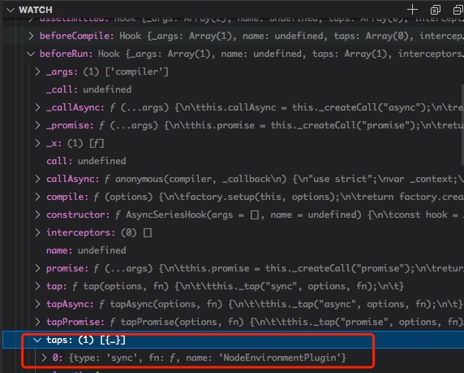

## 调试

想调试webpack源码，有两种方式：

- 一种通过在github上clone webpack源码包，进行配置调试
- 一种是通过npm包调试

感觉还是通过clone webpack源码包调试的比较好一点，也方便调试最新代码和切换版本。

运行webpack配置有两种方式:

- 一种是通过`webpack-cli`中的`webpack`命令运行调试
- 一种是通过引入webpack入口文件进行手动调用`const webpack = require('webpack'); const complier = webpack(config); complier.run(() => {})`

不同的调试方法适合不同的运行方式，下面会进行一一介绍。

> 本文档中调试的webpack版本是5.24.4

### clone调试

首先通过github找到webpack源码，进行clone。通过`https协议`进行克隆，代码如下：

```bash
  git clone https://github.com/webpack/webpack.git
  # 进入webpack文件夹
  cd webpack
  # 可以通过git命令切换到自己想调试的版本
  # git reset v4.30.0

  # 安装npm包
  npm i
```

`clone`源码后要创建一个新的文件夹`debug`，防止对源码侵入。

### debug文件夹

在根目录下创建一个名为`debug`的文件夹, ddebug 文件夹下面文件目录如下：

```js
-- webpack
  -- .vscode
    // 用于在vscode中调试node代码
    -- launch.json
  -- debug
    // 用于打包的文件
    -- src
      -- index.js
    // 手动启动webpack代码
    -- start.js
    // webpack配置文件
    -- webpack.config.js
```

下面就按照文件进行介绍`webpack.config.js`用来配置`webpack`运行时的配置，webpack的配置相当复杂这里只介绍文件中使用到的。

**webpack.config.js**

```js
// 导入node中内置的path模块
const path = require('path')
// 导出webpack配置
module.exports = {
    // 当前debug目录
    context: __dirname,
    // development模式
    mode: 'development',
    // 配置source-map
    devtool: 'source-map',
    // 入口文件设置为src文件下的index.js
    entry: './src/index.js',
    // 出口文件在debug文件夹下dist文件夹
    output: {
        path: path.join(__dirname, './dist'),
    },
    // 配置loader
    module: {
        rules: [
            {
                test: /\.js$/,
                use: ['babel-loader'],
                exclude: /node_modules/,
            }
        ]
    }
}
```

`webpack.config.js`文件主要是在webpack进行初始化和运行时的配置，下面开始看**启动webpack**的文件`start.js`文件。

**start.js**

```js
// 引入webpack某块
const webpack = require('../lib/index.js')
// 引入上面写的webpack配置对象
const config = require('./webpack.config')
// 创建一个complier对象
const complier = webpack(config)
// 执行compiler.run方法开始编译代码，回调方法用于反馈编译的状态
complier.run((err, stats) => {
  // 如果运行时报错输出报错
  if (err) {
    console.error(err)
  } else {
    // stats webpack内置的编译信息对象
    console.log(stats)
  }
})
```

`start.js`是用于启动`webpack`，这里是通过手动引入`webpack`对象，手动初始化`complier`代码进行调试。下面看要进行编译`src/index.js`文件。

**index.js**

```js
  import is from 'object.is'  // 这里引入一个小而美的第三方库，以此观察webpack如何处理第三方包
  console.log('很高兴认识你，webpack')
  console.log(is(1,1))
```

在配置好了上面几个文件后，要配置vscode中调试node代码的配置`launch.json`文件。

**.vscode/launch.json**

```json
  {
    "version": "0.2.0",
    "configurations": [
      {
        // 指定要调试的源码类型
        "type": "node",
        "request": "launch",
        // 调试代码的名称
        "name": "启动webpack调试程序",
        // 指定要启动代码的入口文件
        "program": "${workspaceRoot}/debug/start.js",
        // 输出
        "console": "integratedTerminal"
      }
    ]
  }
```

在配置好`launch.json`文件后，就可以进行打断点调试。

所有的文件创建完成了，就可以打断点进行调试了，主要的调试入口实在`webpack/lib/webpack.js`文件夹中进行创建`complier`对象。

### 最后

无论是在vscode上调试还是在浏览器中调试node服务，一定要在watch模块添加三个对象`compiler`、`compilation`、`options`不然你根本找不到通过`触发钩子的回调函数`，你观察了`compiler`对象就可以很清晰看到它的`compiler.hooks.xxxx.taps等等`上面绑定的回调函数，至今搜索注册对应的回调函数就可以精准的查找到了。如图所示：
