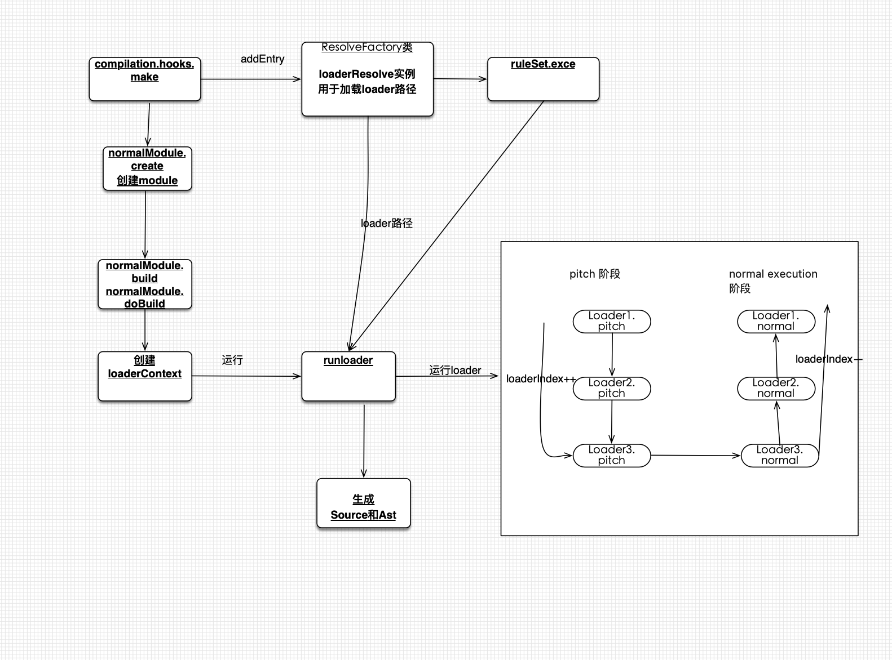
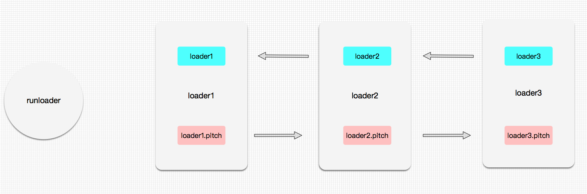

## loader简介

这篇文章中了解一下`webpack`中的`loader`，它是怎么执行的和执行顺序，最后再写一个`loader`来。
`loader`是webpack中也是比较重要的概念，因为**webpack**只能处理`js`类型的代码，比如像`css`就要代码webpack就是不能直接处理的，所以要通过`css-loader`把`css`文件转为`js`代码；`loader`可以看做是一个转换器。

webpack中`loader`路径加载是通过`enhandle-resolve`包来实现的；`loader`的运行是通过`run-loader`来实现的。运行当前模块所有的`loader`时都会传入一个`loaderContext`，在各个loader中都可以通过this来访问这个`loaderContext`。

本篇文章主要包含的内容：

- webpack中loader的配置
- runnerLoader实现
- 常见的loader举例
- 自己手动实现一个loader

`loader`运行大致如下图所示：



### loader执行顺序

`loader`之间的顺序大致分为4种：

- pre： 前置loader
- normal： 普通loader
- inline： 内联loader
- post： 后置loader

4种loader的执行优先级为：`pre > normal > inline > post` 。
相同优先级的loader执行顺序为：`从右到左，从下到上`。

> 所有一个接一个地进入的 loader，都有两个阶段：
>
> 1. Pitching 阶段: loader 上的 pitch 方法，按照 后置(post)、行内(inline)、普通(normal)、前置(pre) 的顺序调用。更多详细信息，请查看 Pitching Loader。
> 2. Normal 阶段: loader 上的 常规方法，按照 前置(pre)、普通(normal)、行内(inline)、后置(post) 的顺序调用。模块源码的转换， 发生在这个阶段。

什么是内联`loader`？相信很多人都没有用过，看一下webpack官方是怎么介绍的。

> "行内 loader"：loader 被应用在 import/require 行内。

`inline loader`有以下几种配置：

- `!前缀`: 在通过`require/import`引入模块的时候，可以通过加上`!前缀`来**禁用普通(normal)loader**.
- `-!前缀`: 在通过`require/import`引入模块的时候，可以通过加上`-!前缀`来**禁用前置(pre) + 普通通(normal)loader**.
- `!前缀`: 在通过`require/import`引入模块的时候，可以通过加上`!!前缀`来**禁用所有loader**.

> 不应使用内联 loader 和 ! 前缀，因为它是非标准的。它们可能会被 loader 生成代码使用。

### loader执行阶段

loader执行阶段又分为两个阶段：

- `pitch`阶段
- `normal execution`阶段

> 如果loader存在`pitch方法`才会存在`pitch`阶段；并且`pitch方法`不是必须的方法。
> `pitch` 是 loader 上的一个方法，它的作用是**阻断 loader 链**。

### 同步loader、异步loader

假定通过`loader runner`运行多个loader，怎么通知`loader runner`应该要执行下一个`loader`了。 `loader`也会分为`同步模式`和`异步模式`，它们的区分其实就是在调用`callback`的方式。

如果想了解loader中更多的属性和配置可以查看[webpack官方配置](https://webpack.docschina.org/api/loaders/)

**同步loader**

同步loader可以通过两种方式来通知`loader runner`已经完成转换，分别是`return source` 和 `this.callback()`来实现。

无论是 `return` 还是 `this.callbac`k 都可以同步地返回转换后的 `content` 值：

`sync-loader.js`

```js
module.exports = function (content, map, meta) {
  return someSyncOperation(content);
};
```

`this.callback`方法则更灵活，因为它允许传递多个参数，而不仅仅是 `content`。

`sync-loader-with-multiple-results.js`

```js

module.exports = function (content, map, meta) {
  this.callback(null, someSyncOperation(content), map, meta);
  return; // 当调用 callback() 函数时，总是返回 undefined
};

```

**异步loader**

对于异步 `loader`，使用 `this.async` 来获取 `callback` 函数：

`async-loader.js`

```js
module.exports = function (content, map, meta) {
  var callback = this.async();
  someAsyncOperation(content, function (err, result) {
    if (err) return callback(err);
    callback(null, result, map, meta);
  });
};
```

> loader 最初被设计为可以在同步 loader pipelines（如 Node.js ，使用 enhanced-require)，以及 在异步 pipelines（如 webpack）中运行。然而，由于同步计算过于耗时，在 Node.js 这样的单线程环境下进行此操作并不是好的方案，我们建议尽可能地使你的 loader 异步化。但如果计算量很小，同步 loader 也是可以的。

### ptich loader

> loader 总是**从右到左**被调用。有些情况下，loader 只关心 request 后面的 **元数据(metadata)**，并且忽略前一个 loader 的结果。在实际**从右到左**执行 loader 之前，会先 **从左到右** 调用 loader 上的 `pitch` 方法。

`pitch`方法不是必须的。如果`loader`中如果存在`pitch`方法，`loader`的执行阶段就会分为两个阶段**pitch阶段**和**normal execution阶段**。

有三个loader: `loader1`、`loader2`、`loader3`，在webpack.config.js中配置三个loader链如下：

```js
  module.exports = {
    module: {
      rules: [{
        use: ['loader1', 'loader2', 'loader3']
      }]
    }
  }
```

`loader`执行过程如下：




在这个过程中如果任何`loader`上的`pitch`方法有返回值，则会跳过后面所有的`loader`执行，直接进入`normal execution`阶段，并且是从`pitch`的上一个`loader`开始。

假设是在`loader2`中的`pitch`方法有返回值，执行过程如下：

## loader匹配、路径加载

首先通过`ResloverFactory`来创建`normalResolver`和`loaderResolver`用来加载文件信息和loader文件信息。接着`normalResolver(entry)`加载入口文件信息，然后通过`ruleSet.exec(resourceData)`来匹配当前`module`所需要的loader，在通过`loaderResolver`来加载`loader`的路径信息，并且通过`loader.type`对要所有的loader进行排序。

## runloader实现

`runloader`方法是webpack一个独立的npm包，叫做[loader-runner](https://github.com/webpack/loader-runner)。

在webpack[运行loader源码](https://github.com/webpack/webpack/blob/master/lib/NormalModule.js)如下：

```js
  // ./lib/NormalModule.js
  import { runLoaders } = reuqire('loader-runner')
  class NormalModule extends Module {
    // 在doBuild中运行runLoaders
    doBuild (options, compilation, resolver, fs, callback) {
      // 首先创建loaderContext
      // 想了解loaderContext中都有哪些属性的话请看 https://webpack.docschina.org/api/loaders/#the-loader-context
      const loaderContext = this.createLoaderContext(
        resolver,
        options,
        compilation,
        fs
      );
      // 通过runLoaders运行loaders
      runLoaders(
        {
          resource: this.resource, // 这个模块的路径
          loaders: this.loaders, // 模块所使用的 loaders
          context: loaderContext, // loaderContext 上下文
          readResource: fs.readFile.bind(fs) // 读取文件的 node api
        },
        (err, result) => {
          // do something
        }
      )
    }
  }
```

首先会初始化`loaderContext`对象，这个对象是比较重要的，`loadercontext` 表示在 `loader` 内使用 **this 可以访问的一些方法或属性**。

`loaderContext`中比较重要的几个属性：

- `this.callback`: 可以同步或者异步调用的并返回多个结果的函数。
- `this.async`: 告诉 `loader-runner` 这个 loader 将会异步地回调。返回 `this.callback`。
- `this.data`: 在 `pitch 阶段`和 `normal 阶段`之间共享的 `data` 对象。
- `this.loaders`: 所有 `loader 组成`的数组。它在 pitch 阶段的时候是可以写入的。
- `this.loaderIndex`: 当前 loader 在 loader 数组中的**索引**。
- `this.hot`: loaders 的 HMR（热模块替换）相关信息。

看一下`loader-runner`是怎么运行webpack中的loader。

### loader-runner

`runloaders`是`loader-runner`中最核心的代码的，代码如下：

```js
  // loader runner包
  // lib/loader-runner/LoaderRunner.js
  export.runLoaders = function runLoaders(options, callback) {
    // read options

    // 处理options
    var loaderContext = options.context || {}; // 在 normalModule 里面创建的 loaderContext

    loaders = loaders.map(createLoaderObject); // 处理 loaders

    // 拓展 loaderContext 的属性
    loaderContext.context = contextDirectory;
    loaderContext.loaderIndex = 0; // 当前正在执行的 loader 索引
    loaderContext.loaders = loaders;
    loaderContext.resourcePath = resourcePath;
    loaderContext.resourceQuery = resourceQuery;
    loaderContext.async = null; // 异步 loader
    loaderContext.callback = null;

    // 监听loaderContext上的data属性
    Object.defineProperty(loaderContext, "data", {
      enumerable: true,
      get: function() {
        return loaderContext.loaders[loaderContext.loaderIndex].data;
      }
    });
    // 运行loader
    iteratePitchingLoaders(processOptions, loaderContext, function(err, result) {
      if(err) {
        return callback(err, {
          cacheable: requestCacheable,
          fileDependencies: fileDependencies,
          contextDependencies: contextDependencies,
          missingDependencies: missingDependencies
        });
      }
      // 执行传入的回调函数
      callback(null, {
        result: result,
        resourceBuffer: processOptions.resourceBuffer,
        cacheable: requestCacheable,
        fileDependencies: fileDependencies,
        contextDependencies: contextDependencies,
        missingDependencies: missingDependencies
      });
    });
  }
```

在`runLoaders`中首先会对传入的`options`进行处理，并且扩展`loaderContext`对象。`loaderContext`就是在`loader`中可以通过`this`访问的属性集合。在处理完成`options`和`loaderContext`之后直接调用`iteratePitchingLoaders`开始运行loader.

```js
  // loader runner包
  // lib/loader-runner/LoaderRunner.js
  function iteratePitchingLoaders (options, loaderContext, callback) {
    // abort after last loader， loaderIndex初始为0，当所有loader pitch都执行完后，if条件成立 运行processResource方法
    if (loaderContext.loaderIndex >= loaderContext.loaders.length) return processResource(options, loaderContext, callback);

    // 当前loader；根据loaderIndex 获取当前loader
    var currentLoaderObject = loaderContext.loaders[loaderContext.loaderIndex];

    // iterate，如果当前loader的pitch已经执行过，继续递归下一个loader
    if (currentLoaderObject.pitchExecuted) {
      loaderContext.loaderIndex++;
      return iteratePitchingLoaders(options, loaderContext, callback);
    }

    // load loader module，加载loader的实现,
    // loader默认导出函数赋值给normal属性，pitch函数赋值给pitch属性
    loadLoader(currentLoaderObject, function(err) {
      var fn = currentLoaderObject.pitch; // pitch函数
      currentLoaderObject.pitchExecuted = true;
      // 没有pitch函数则递归下一个
      if (!fn) return iteratePitchingLoaders(options, loaderContext, callback);

      // 执行pitch函数，同步或者异步的
      runSyncOrAsync(fn, loaderContext, [loaderContext.remainingRequest, loaderContext.previousRequest, (currentLoaderObject.data = {})], function(
        err,
      ) {
        // args表示pitch函数的返回值，如果存在则跳过后续的递归处理流程，直接掉头处理loader的normal函数
        // 在官网文档中也有专门的描述： https://webpack.js.org/api/loaders/#pitching-loader
        var args = Array.prototype.slice.call(arguments, 1);
        // 根据是否有参数返回来判断是否向下继续进行 pitch 函数的执行
        var hasArg = args.some(function(value) { return value !== undefined; });
        if (args.length > 0) {
          loaderContext.loaderIndex--;
          // 执行普通的loader方法
          iterateNormalLoaders(options, loaderContext, args, callback);
        } else {
          // 执行pitch方法
          iteratePitchingLoaders(options, loaderContext, callback);
        }
      });
    }
  }
```

`iteratePitchingLoaders` 方法执行每个 loader 上提供的 `pitch` 函数，然后再通过`runSyncOrAsync`来运行`loader`方法。

- 首先通过`loaderContext.loaderIndex`获取当前`currentLoaderObject`对象，然后通过`currentLoaderObject.pitchExecuted`来判断当前loader是否执行过pitch.
- `loadLoader(currentLoaderObject, callback)`函数来加载这个`loader`，`loadLoader`内容兼容了`SystemJS`、`ES Module`、`CommonJs`这些模块的定义，最终会将 loader 提供的 `pitch` 方法和普通方法赋值到 `currentLoaderObject` 上。
- `loadLoader`加载完成之后，运行`runSyncOrAsync`方法。

`iteratePitchingLoaders`一直会递归调用`iteratePitchingLoaders`来执行`currentLoaderObject.pitch`上的`pitch`方法，执行`pitch函数`的时候就是`pitch 阶段`，在根据`loaderContext.loaderIndex`执行完成所有`currentLoaderObject.pitch`上的`pitch`方法，会调用`processResource`进入`normal exections` 阶段；如果在`pitch`阶段只要任何一个`loader`返回的结果不是`undefined`，直接进入`normal exections`阶段，并且运行上一个loader。

`pitch`函数主要是可以利用 module 的 request，来做一些拦截处理的工作，从而达到在 loader 处理流程当中的一些定制化的处理需要。

### loadLoader加载loader

看一下`loadLoader`的实现如下：

```js
  // loader runner包
  // lib/loader-runner/loadLoader.js
  function handleResult(loader, module, callback) {
    // 判断导入的对象是否为function和object
    if(typeof module !== "function" && typeof module !== "object") {
      return callback(new LoaderLoadingError(
        "Module '" + loader.path + "' is not a loader (export function or es6 module)"
      ));
    }
    // 并且把导入的对象赋值到loader对象上
    loader.normal = typeof module === "function" ? module : module.default;
    loader.pitch = module.pitch;
    loader.raw = module.raw;
    if(typeof loader.normal !== "function" && typeof loader.pitch !== "function") {
      return callback(new LoaderLoadingError(
        "Module '" + loader.path + "' is not a loader (must have normal or pitch function)"
      ));
    }
    // 执行回调函数
    callback();
  }
  module.exports = function loadLoader (loader, callback) {
    if(loader.type === "module") {
      // 通过 import 引入 module
      modulePromise.then(function(module) {
        handleResult(loader, module, callback);
      }, callback);
    } else {
      var module = require(loader.path);
      return handleResult(loader, module, callback);
    }
  }
```

简单来说`loadLoader`函数就是一个模块加载的`polyfill`函数，用于抹平不同模块加载的方式。

### processResource执行normal exection

执行`processResource`表示进入loader的`normal exection`阶段，看一下`processResource`代码：

```js
  // loader runner包
  // lib/loader-runner/LoaderRunner.js
  function processResource(options, loaderContext, callback) {
    // set loader index to last loader
    loaderContext.loaderIndex = loaderContext.loaders.length - 1;
    获取l
    var resourcePath = loaderContext.resourcePath;
    if(resourcePath) {
      options.processResource(loaderContext, resourcePath, function(err, buffer) {
        options.resourceBuffer = buffer;
        iterateNormalLoaders(options, loaderContext, [buffer], callback);
      });
    } else {
      iterateNormalLoaders(options, loaderContext, [null], callback);
    }
  }
```

在 `processResouce` 方法内部调用 `node api readResouce`读取 module 对应路径的文本内容，调用 `iterateNormalLoaders` 方法，开始进入 `loader normal` 方法的执行阶段。

### iterateNormalLoaders

`iterateNormalLoaders`递归迭代`normal函数`，和`pitch`的流程大同小异，需要注意的是**顺序是反过来**的，**从后往前**。

```js
// loader runner函数
// lib/loader-runner/LoaderRunner.js
// 与iteratePitchingLoaders类似，只不过是从后往前执行每个loader的normal函数
  function iterateNormalLoaders(options, loaderContext, args, callback) {
    if(loaderContext.loaderIndex < 0)
      return callback(null, args);

    var currentLoaderObject = loaderContext.loaders[loaderContext.loaderIndex];

    // iterate 循环调用
    if(currentLoaderObject.normalExecuted) {
      loaderContext.loaderIndex--;
      return iterateNormalLoaders(options, loaderContext, args, callback);
    }

    // 在loadLoader中加载loader的实现，
    // loader默认导出函数赋值给normal属性，pitch函数赋值给pitch属性
    var fn = currentLoaderObject.normal;
    currentLoaderObject.normalExecuted = true;
    if(!fn) {
      return iterateNormalLoaders(options, loaderContext, args, callback);
    }
    // 根据raw来转换args， https://webpack.js.org/api/loaders/#-raw-loader
    convertArgs(args, currentLoaderObject.raw);

    // fn: function ( source, inputSourceMap ) { … }
    runSyncOrAsync(fn, loaderContext, args, function(err) {

      // 将前一个loader的处理结果传递给下一个loader
      var args = Array.prototype.slice.call(arguments, 1);
      iterateNormalLoaders(options, loaderContext, args, callback);
    });
  }
```

`iterateNormalLoaders`执行顺序和`pitch`执行是反着的。loader中的`normal`和`pitch`函数它们可以是同步的或者异步的，这里就要看一下`runSyncOrAsync`的实现了。

### runSyncOrAsync

`runSyncOrAsync`用于执行一个**同步或异步的fn**，执行完后触发传入的回调函数，webpack中的**同步/异步**loader就是通过当前函数来区分的。

```js
  // loader runner函数
  // lib/loader-runner/LoaderRunner.js
  function runSyncOrAsync(fn, context, args, callback) {
    var isSync = true; // 是否为同步
    var isDone = false; // 是否执行完成
    var isError = false; // internal error
    var reportedError = false;
    // 给 loaderContext 上下文赋值 async 函数，用以将 loader 异步化，并返回异步回调
    context.async = function async() {
      if(isDone) {
        if(reportedError) return; // ignore
        throw new Error("async(): The callback was already called.");
      }
      isSync = false;
      return innerCallback;
    };
    // callback 的形式可以向下一个 loader 多个参数
    var innerCallback = context.callback = function() {
      if(isDone) {
        if(reportedError) return; // ignore
        throw new Error("callback(): The callback was already called.");
      }
      isDone = true;
      isSync = false;
      try {
        callback.apply(null, arguments);
      } catch(e) {
        isError = true;
        throw e;
      }
    };
    try {
      // 开始执行 loader
      var result = (function LOADER_EXECUTION() {
        return fn.apply(context, args);
      }());
      // 如果为同步的执行
      if(isSync) {
        isDone = true;
        // 如果 loader 执行后没有返回值，执行 callback 开始下一个 loader 执行
        if(result === undefined)
          return callback();
        // loader 返回值为一个 promise 函数，放到下一个 mircoTask 中执行下一个 loader。这也是 loader 异步化的一种方式
        if(result && typeof result === "object" && typeof result.then === "function") {
          return result.then(function(r) {
            callback(null, r);
          }, callback);
        }
        // 如果 loader 执行后有返回值，执行 callback 开始下一个 loader 执行
        return callback(null, result);
      }
    }
  }
```

webpack中的**同步loader**，因为`isSync`默认为`true`，运行loader的normal方法返回`result`对象；并且在`loader`中定义callback方法，用于同步方法调用。
webpack中的**异步loader**: 会调用`async()`会把`isSync`设置为`false`，然后返回callback函数。这个`callback`的获取就是可以在laoder中控制的，后面再调用`callback`函数，进入下一个loader的执行。

## 常用loader

### style-loader 和 css-loader

`style-loader` 通常不会独自使用，而是跟 `css-loader` 连用。`css-loader` 的返回值是一个 `js` 模块，然后`style-loader`把`css-loader`返回的内容进行处理。

1. css-loader 的作用是处理css中的 `@import` 和 `url`这样的外部资源
2. style-loader 的作用是把样式插入到 DOM中，方法是在head中插入一个style标签，并把样式写入到这个标签的 innerHTML 里。

在webpack.config.js来使用`css-loader`和`style-loader`的配置：

```js
  module.exports = {
    module: {
      rules: [
        {
          test: /\/css$/,
          use: [
            {
              loader: "style-loader"
            },
            {
              loader: "css-loader"
            }
          ]
        }
      ]
    }
  }
```

#### style-loader原理

`style-loader` 的主要作用就是把 `CSS 代码`插入DOM中核心代码如下：

```js
module.exports.pitch = function (request) {
  return [
      "var content = require(" + loaderUtils.stringifyRequest(this, "!!" + request) + ");", // 获取 CSS 文件的内容
      "if(typeof content === 'string') content = [[module.id, content, '']];",
      "// Prepare cssTransformation",// 省略无关内容
      "// add the styles to the DOM",
      "var update = require(" + loaderUtils.stringifyRequest(this, "!" + path.join(__dirname, "lib", "addStyles.js")) + ")(content, options);", // 调用 addStyles ，把CSS内容插入到DOM中去
      "if(content.locals) module.exports = content.locals;", // 支持 css modules，如果启用了 css modules，class的映射就放在 content.locals 中，因此直接默认导出，我们 import 的时候就会得到一个映射字典。
      options.hmr ? hmrCode : ""
    ].join("\n");
}
```

它其实就是返回了一段JS代码，这段代码主要就分为两步：

1. 通过 require 来获取CSS文件的内容，得到是一个字符串
2. 调用 addStyles 把CSS内容插入到 DOM中去

为什么`style-loader`中只有`pitch`函数没有`normal`函数，因为loader的`normal`函数执行顺序是从右往左，先执行`css-loader`它会返回一段`JS字符串`，这样`style-loader`就娶不到`CSS样式`了。为了获取`CSS样式`在`style-loader`中的`pitch`函数通过`require`来获取。

`pitch`函数和`normal`函数的区别：**在默认模式下是当字符串传入的，在pitching模式下是当代码运行的**。

### css-loader原理

`css-loader`主要是用来解析`@import`和`url`语句，`modules`等等也是在`css-loader`上实现的。

`css-loader· 的主要代码包含这两部分：

- `processCss.js` 中会调用 `postcss` 对 css 源码进行解析，然后遍历其中的 `declaration` 并抽离出 `url` 和 `import` 这两种依赖
- `loader.js` 会调用 `processCss`，根据它已经分析出的 `url` 和 `import` 依赖关系，在对应的代码中替换成 `require`，并拼接成段最终的JS返回

另外 还包含了 调用 `postcss` 相关的模块对CSS新特性的编译，对 `sourcemap` 的处理等。

processCss.js 中 parserPlugin 代码分析

```js
// parsePlugin 调用 postcss 对css代码进行语法分析，然后把其中的 `@import` 和 `url` 两种依赖收集起来，url 还会被替换成一个占位符
var parserPlugin = postcss.plugin("css-loader-parser", function(options) {
    return function(css) {
        var imports = {};
        var exports = {};
        var importItems = [];
        var urlItems = [];
        // 省略了一些不重要的代码
        if(options.import) {
            css.walkAtRules(/^import$/i, function(rule) {
                // 省略代码，这里主要收集 import 依赖，并存入 importItems 中
                // 在我们的这个示例项目中，最终 importItems 就是 [ { url: './global.css', mediaQuery: '' } ]
           });
        }
        // 最重要的函数，这里处理每一条样式声明
        // 如果发现
        function processNode(item) {
            switch (item.type) {
                case "value":
                    item.nodes.forEach(processNode);
                    break;
                case "nested-item":
                    item.nodes.forEach(processNode);
                    break;
                case "item":
                    // 这一块没太懂，因为如果是 `@import ‘xxx.css’` 其实并不是在这里处理的，而是在 上面的 css.walkAtRule 就处理了
                    var importIndex = imports["$" + item.name];
                    if (typeof importIndex === "number") {
                        item.name = "___CSS_LOADER_IMPORT___" + importIndex + "___";
                    }
                    break;
                case "url":
                    // 如果是一个url，比如 `background-image: url(./xxx.png)` 那么 就把 这个依赖记录到 urlItems 中，同时把 `xxx.png` 替换成一个 占位符 `___CSS_LOADER_URL___i___`
                    if (options.url && item.url.replace(/\s/g, '').length && !/^#/.test(item.url) && (isAlias(item.url) || loaderUtils.isUrlRequest(item.url, options.root))) {
                        // Don't remove quotes around url when contain space
                        if (item.url.indexOf(" ") === -1) {
                            item.stringType = "";
                        }
                        delete item.innerSpacingBefore;
                        delete item.innerSpacingAfter;
                        var url = item.url;
                        item.url = "___CSS_LOADER_URL___" + urlItems.length + "___";
                        urlItems.push({
                            url: url
                        });
                    }
                    break;
            }
        }
        
        // 遍历所有的样式声明，比如 `color: red` 就是一个 decl
        // 对每一条样式都调用 processNode 进行处理
        css.walkDecls(function(decl) {
            var values = Tokenizer.parseValues(decl.value);
            values.nodes.forEach(function(value) {
                value.nodes.forEach(processNode);
            });
            decl.value = Tokenizer.stringifyValues(values);
        });
        css.walkAtRules(function(atrule) {
            if(typeof atrule.params === "string") {
                atrule.params = replaceImportsInString(atrule.params);
            }
        });

        options.importItems = importItems;
        options.urlItems = urlItems;
        options.exports = exports;
    };
});

```

loader.js

```js
  // processCss 已经解析出了依赖，那么在这里我们就要把这些依赖替换成 `require` ，这样webpack就能处理了。
processCss(content, map, {
        mode: moduleMode ? "local" : "global", // 是否启用 css modules
         // 省略...
    }, function(err, result) {
        if(err) return callback(err);

        var cssAsString = JSON.stringify(result.source);

        // for importing CSS
        var importUrlPrefix = getImportPrefix(this, query);

        var alreadyImported = {};
        // 这里开始处理 importItems 中记录的依赖，比如 对 `global.css` 的依赖
        var importJs = result.importItems.filter(function(imp) {
            // 因为很可能同一个模块会被多次依赖，所以要去重一下。
            if(!imp.mediaQuery) {
                if(alreadyImported[imp.url])
                    return false;
                alreadyImported[imp.url] = true;
            }
            return true;
        }).map(function(imp) {
            // 对于新的依赖，就在这里处理
            if(!loaderUtils.isUrlRequest(imp.url, root)) {
                // 如果不是一个文件的依赖，比如你是对一个线上资源的依赖，那么就会进到这里，这样就直接把它编译成css 的import语句。这样最终还是在浏览器中去加载这个远程的资源。
                return "exports.push([module.id, " +
                    JSON.stringify("@import url(" + imp.url + ");") + ", " +
                    JSON.stringify(imp.mediaQuery) + "]);";
            } else {
                // 如果是对一个文件的依赖，那么我们不用把它编译成css import ，而是直接替换成 `require`，webpack 会最终直接把依赖的文件内容打包进来了，不会存在 css import
                var importUrl = importUrlPrefix + imp.url;
                return "exports.i(require(" + loaderUtils.stringifyRequest(this, importUrl) + "), " + JSON.stringify(imp.mediaQuery) + ");";
            }
        }, this).join("\n");

        // 省略 importItems 内容

        // processCss 已经把 url 替换成了 ___CSS_LOADER_URL___i___ ，所以这里找到这些占位符，并把他们替换成对应的 `require` 语句。
        if(query.url !== false) {
            cssAsString = cssAsString.replace(result.urlItemRegExpG, function(item) {
                var match = result.urlItemRegExp.exec(item);
                var idx = +match[1];
                var urlItem = result.urlItems[idx];
                var url = resolve(urlItem.url);
                idx = url.indexOf("?#");
                if(idx < 0) idx = url.indexOf("#");
                var urlRequest;
                if(idx > 0) { // idx === 0 is catched by isUrlRequest
                    // in cases like url('webfont.eot?#iefix')
                    urlRequest = url.substr(0, idx);
                    return "\" + require(" + loaderUtils.stringifyRequest(this, urlRequest) + ") + \"" +
                            url.substr(idx);
                }
                urlRequest = url;
                return "\" + require(" + loaderUtils.stringifyRequest(this, urlRequest) + ") + \"";
            }.bind(this));
        }

        // 如果有启用 cssmodules,那么对应的classname的映射关系就存在 `exports.locals` 中
        var exportJs = compileExports(result, importItemMatcher.bind(this), camelCaseKeys);
        if (exportJs) {
            exportJs = "exports.locals = " + exportJs + ";";
        }

        var moduleJs;
        // 别忘了导出自己，就是当前文件的内容
        moduleJs = "exports.push([module.id, " + cssAsString + ", \"\"]);";

        // embed runtime
        // 生成最终的js代码
        callback(null, "exports = module.exports = require(" +
            loaderUtils.stringifyRequest(this, require.resolve("./css-base.js")) +
            ")(" + query.sourceMap + ");\n" +
            "// imports\n" +
            importJs + "\n\n" +
            "// module\n" +
            moduleJs + "\n\n" +
            "// exports\n" +
            exportJs);
    }.bind(this));
```

## 实现一个自己的loader

要开发一个自定义loader，可以使用其它的几个辅助的npm包。

[loader-utils](https://github.com/webpack/loader-utils#readme)用来获取loader中options等等。

- `getOptions` 获取 loader 的配置项。
- `interpolateName` 处理生成文件的名字。
- `stringifyRequest` 把绝对路径处理成相对根目录的相对路径。

[schema-utils](https://github.com/webpack/schema-utils)用来验证`loader options`配置的合法性。

### 开发约定

为了让我们的 loader 具有更高的质量和复用性，记得保持简单。也就是尽量保持让一个 loader 专注一件事情，如果发现你写的 loader 比较庞大，可以试着将其拆成几个 loader 。

在 webpack 社区，有一份 loader 开发准则，我们可以去参考它来指导我们的 loader 设计：

- 保持简单。
- 利用多个loader链。
- 模块化输出。
- 确保loader是无状态的。
- 使用 loader-utils 包。
- 标记加载程序依赖项。
- 解析模块依赖关系。
- 提取公共代码。
- 避免绝对路径。
-使用 peerDependency 对等依赖项。

### 开发一个raw-loader

`raw-loader`文件目录如下：

```js
  // -- src
    // -- async.txt 简单的文本
    // -- demo.txt 简单的文本
    // -- raw-loader.js loader代码
  // -- run-loader.js  测试代码
```

`async.txt`和`demo.txt`中的代码实现如下：

```txt
  <!-- async.txt -->
  async

  <!-- demo.txt -->
  demo
```

`raw-loader.js`中来实现真正的loader代码如下：

```js
  const loaderUtils = require('loader-utils');
  const path = require('path');

  module.exports = function (source) {
    const url = loaderUtils.interpolateName(this, "[name].[ext]", {
        source,
    });

    this.emitFile(path.join(__dirname, url), source);
    const json = JSON.stringify(source)
      .replace('foo', '')
      .replace(/\u2028/g, '\\u2028')
      .replace(/\u2029/g, '\\u2029');
    
    return `export default ${json}`;
  }
```

测试代码`run-loader.js`如下：

```js
  const { runLoaders } = require('loader-runner');
  const fs = require('fs');
  const path = require('path');

  runLoaders({
    resource: path.join(__dirname, './src/demo.txt'),
    loaders: [
      {
        loader: path.join(__dirname, './src/raw-loader.js'),
        options: {
          name: 'test'
        }
      }
    ],
    context: {
      emitFile: () => {}
    },
    readResource: fs.readFile.bind(fs)
  }, (err, result) => {
    err ? console.log(err) : console.log(result);
  })
```

简单的`raw-loader`到此就实现了，但是要写一个比较好的`loader`，是要花费很多时间和精力。