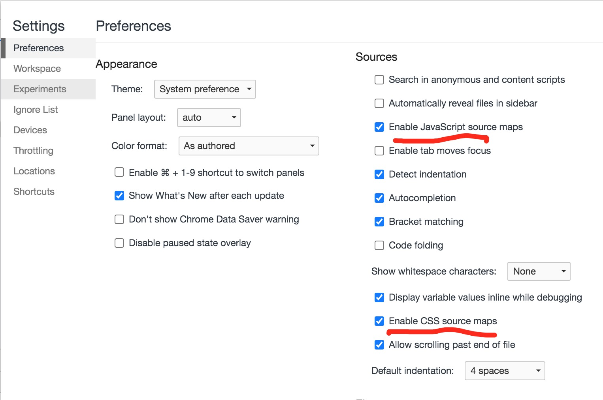

## SourceMap

`sourceMap`对现在的项目来说也是比较重要的，因为在打包完成之后的代码是经过`混淆`、`压缩`的，不能很好的进行定位。如果想看到准确的代码位置，`Source Maps（源映射）` 通过提供原始代码和转换后代码之间的映射 来解决这个问题。

本篇文章大致小节如下：

- 历史渊源
- 使用`sourceMap`
- `sourceMap`组成部分
- webpack源码中的`sourceMap`(源码角度)
- `sourceMap`的作用

### 历史渊源

在2009年google的一篇[文章](https://googlecode.blogspot.com/2009/11/introducing-closure-tools.html)中，在介绍[Cloure Compiler](https://developers.google.com/closure/compiler/?hl=zh-CN)（一款js压缩优化工具，可类比于uglify-js）时，google也顺便推出了一款调试工具：firefox插件Closure Inspector，以方便调试编译后代码。这就是sourcemap的最初代啦！

> You can use the compiler with Closure Inspector , a Firebug extension that makes debugging the obfuscated code almost as easy as debugging the human-readable source.

2010年，在第二代即 [Closure Compiler Source Map 2.0](https://docs.google.com/document/d/1xi12LrcqjqIHTtZzrzZKmQ3lbTv9mKrN076UB-j3UZQ/edit?hl=en_US) 中，sourcemap确定了统一的json格式及其余规范，已几乎具有现在的雏形。最大的差异在于mapping算法，也是sourcemap的关键所在。第二代中的mapping已决定使用base 64编码，但是算法同现在有出入，所以生成的.map相比现在要大很多。
2011年，第三代即 [Source Map Revision 3.0](https://docs.google.com/document/d/1U1RGAehQwRypUTovF1KRlpiOFze0b-_2gc6fAH0KY0k/edit?hl=en_US&pli=1&pli=1#heading=h.3l2f9su3ov2l) 出炉了，这也是我们现在使用的sourcemap版本。从文档的命名看来，此时的sourcemap已脱离Clousre Compiler，演变成了一款独立工具，也得到了浏览器的支持。这一版相较于二代最大的改变是mapping算法的压缩换代，使用VLQ编码生成base64前的mapping，大大缩小了.map文件的体积。

Sourcemap发展史的有趣之处在于，它作为一款辅助工具被开发出来。最后它辅助的对象日渐式微，而它却成为了技术主体，被写进了浏览器中。

> sourcemap v1最开始生成的sourcemap文件大概有转换后文件的10倍大。sourcemap v2将之减少了50%，v3又在v2的基础上减少了50%。所以目前133k的文件对应的sourcemap文件大小大概在300k左右。

### 浏览器中使用sourceMap

怎么在浏览器中使用`sourceMap`，chrome浏览器中默认是开启了`soruce Map`功能。如果被关闭可以手动开启，下图所示：



> Mac OS 系统中的 Google Chrome 版本 Version 89.0.4389.90 (Official Build) (x86_64)

**创建项目**

可以通过`vue-cli`脚手架创建一个vue项目，也可以通过我自己的脚手架`vuetemplates-cli`来创建项目，执行命令如下：

```bash
  # 全局安装脚手架
  $ npm install -g vuetemplates-cli
  # 初始化项目
  $ vuetemplates init template-spa my-project-name
  # 切换目录
  $ cd my-project-name
  # 安装npm
  $ npm install
```

安装完成后，修改`./build/webpack.prod.js`如下：

```js
  {
    devtool: 'source-map'
  }
```

在`src`文件夹下创建`soureMap_test.js`文件，写入：

```js
  export default {
    name: 'I AM CHRIS'
  }
```

在`mian.js`通过`import ('./soureMap_test.js')`。

修改完成后执行运行命令：

```bash
  # 命令会进行打包、启动一个端口7087
  npm run start
```

这样就可以再浏览器端看到通过`sourceMap`映射显示出来的源码。如果代码运行报错的时候，就可以很精准的定位到错误代码的源代码位置，而不是打包之后的代码。

## sourceMap组成部分

在上面运行`npm run start`后会进行打包，打包的资源会在`./dist/public/static/js/**.map`，这里就以`soureMap_test.xxxx.js.map`为样例。

```json
// ./dist/public/static/js/soureMap_test.xxxx.js.map
{
  "version": 3,
  "sources": [ "webpack:///./src/soureMap_test.ts" ],
  "names": [ "name" ],
  "mappings": "qJAOe,CACbA,KAAM",
  "file": "public/static/js/soureMap_test.be52e997.js",
  "sourcesContent": [
    "/*\n * @Descripttion: \n * @Author: 19080088\n * @Date: 2021-03-30 17:24:57\n * @LastEditors: 19080088\n * @LastEditTime: 2021-03-30 17:32:26\n */\nexport default {\n  name: 'I AM CHRIS'\n}"
  ],
  "sourceRoot": ""
}
```

**sourceMap格式**

```json
{ 
  "version": 3, // source map 的版本。
  "sources": [], // 转换前的文件，该项是一个数组，表示可能存在多个文件合并。
  "names": [], // 转换前的所有变量名和属性名。
  "mappings": "", // 记录位置信息的字符串。
  "file": "", // 转换后的文件名。
  "sourcesContent": [""] // 转换前文件的内容，当没有配置 sources 的时候会使用该项。
}
```

